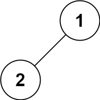

144.二叉树的前序遍历


```
输入：root = [1,null,2,3]
输出：[1,2,3]
```

示例 2：
```
输入：root = []
输出：[]
```

示例 3：
```
输入：root = [1]
输出：[1]
```



示例 4:
```
输入：root = [1,2]
输出：[1,2]
```

示例 5:
```
输入：root = [1,null,2]
输出：[1,2]
```